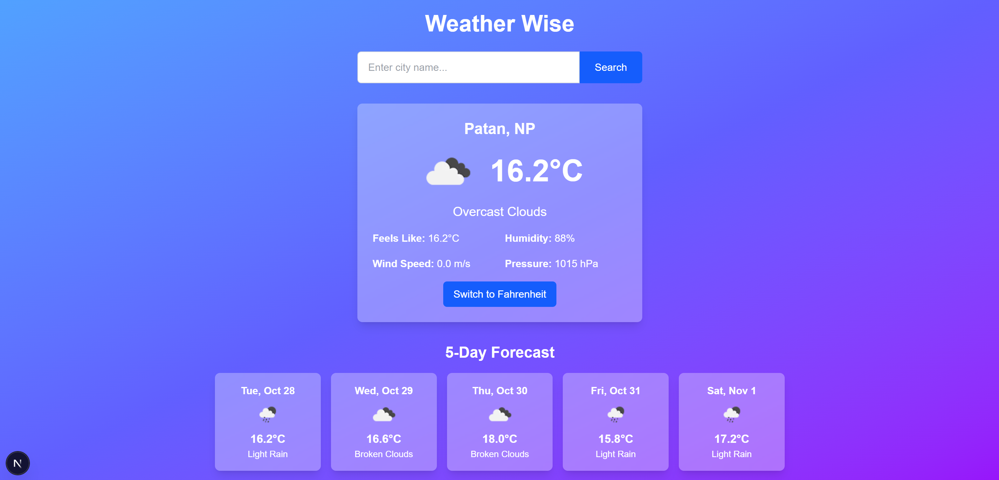

#  Weather Web App

A modern weather web application built with **Next.js** and **React** that allows users to search for cities and view real-time weather information.  
It features a clean and responsive UI.

---

---
##  Features

-  Search weather by city name  
-  Displays temperature, humidity, and weather conditions  
-  Real-time data fetched from a weather API (e.g., OpenWeatherMap)  

---

##  Tech Stack

- [Next.js](https://nextjs.org/)
- [React](https://react.dev/)
- [Tailwind CSS](https://tailwindcss.com/)
- [OpenWeatherMap API](https://openweathermap.org/api)